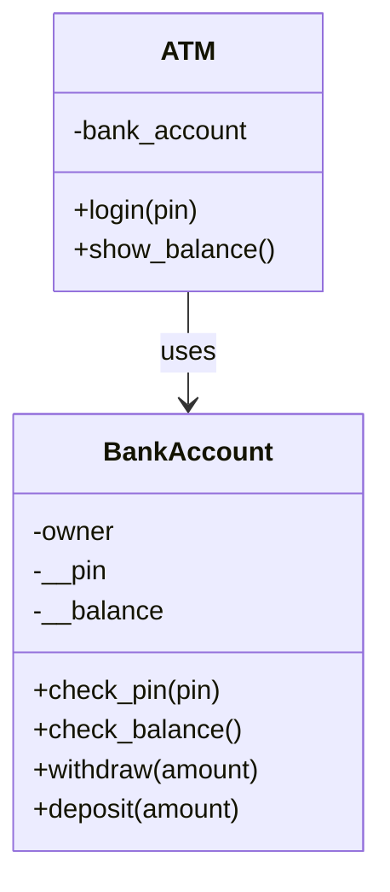
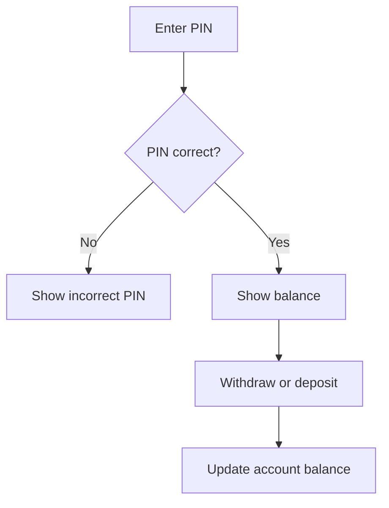
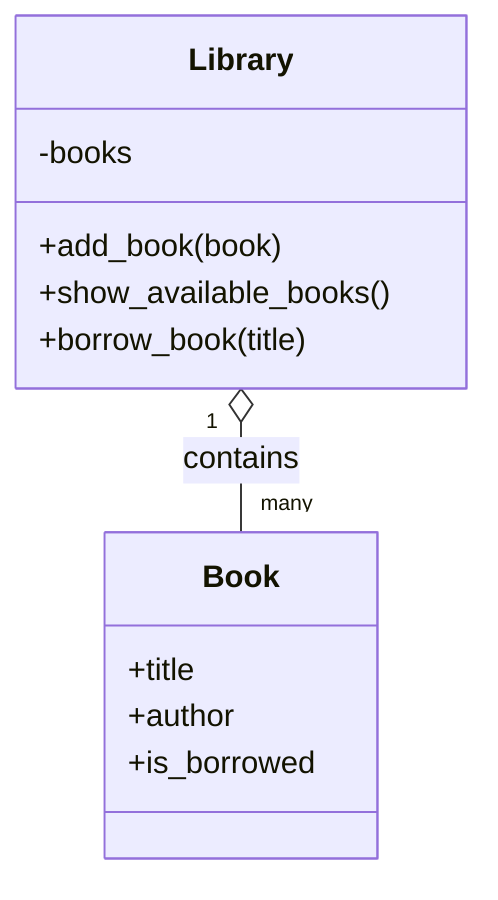
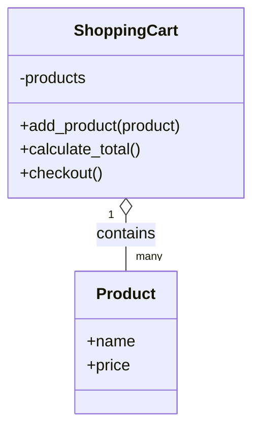

# Real-World OOP Examples

These examples show how classes model real objects and how methods model actions.

## ATM Machine

Flow:

Code: [01_atm_machine.py](01_atm_machine.py)

## Library System

Code: [02_library_system.py](02_library_system.py)

## Shopping Cart

Code: [03_shopping_cart.py](03_shopping_cart.py)

