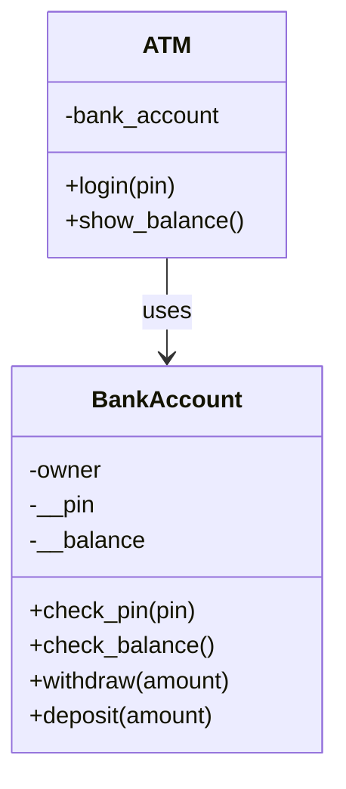
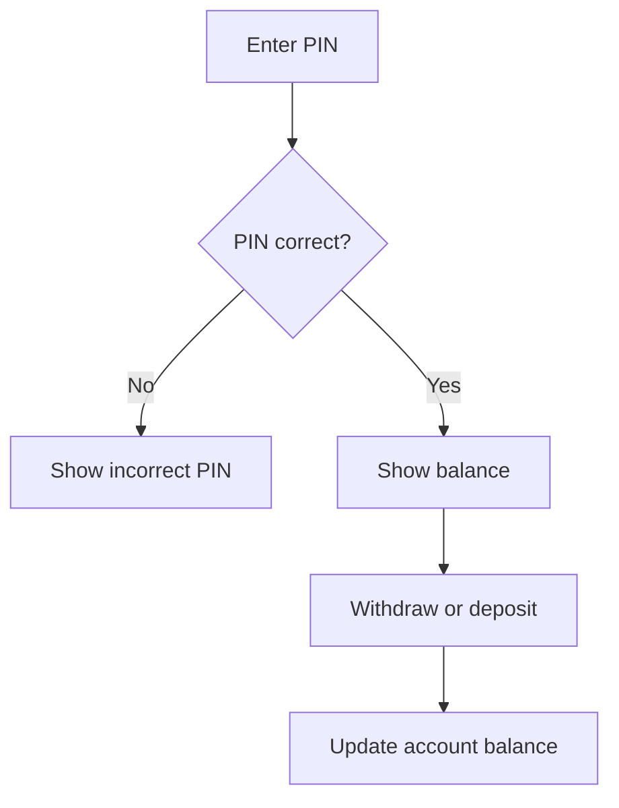
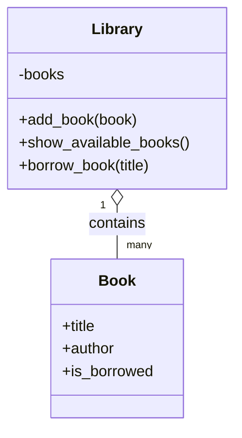
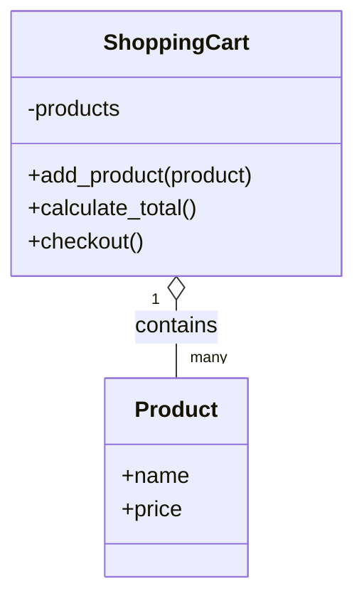
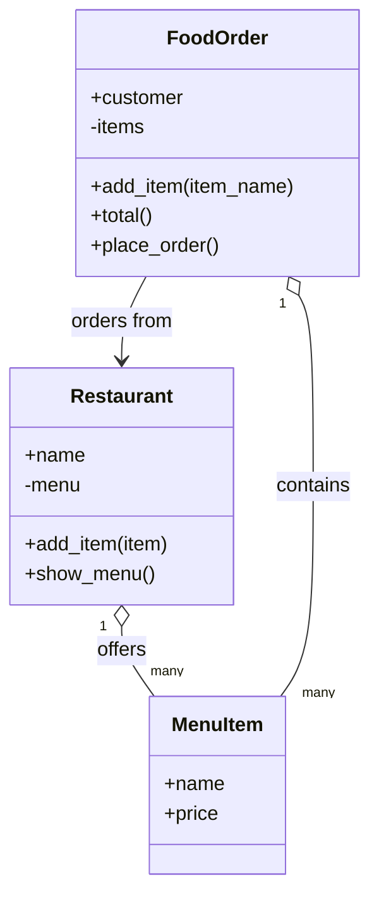
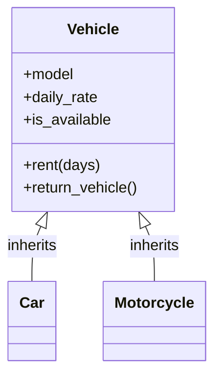

# Real-World OOP Examples

These examples show how classes model real objects and how methods model actions.

## ATM Machine

Flow:

Code: [01_atm_machine.py](01_atm_machine.py) | [AtmMachineExample.java](AtmMachineExample.java)

## Library System

Code: [02_library_system.py](02_library_system.py) | [LibrarySystemExample.java](LibrarySystemExample.java)

## Shopping Cart

Code: [03_shopping_cart.py](03_shopping_cart.py) | [ShoppingCartExample.java](ShoppingCartExample.java)

## Food Ordering

Code: [04_food_order.py](04_food_order.py) | [FoodOrderExample.java](FoodOrderExample.java)

## Vehicle Rental

Code: [05_vehicle_rental.py](05_vehicle_rental.py) | [VehicleRentalExample.java](VehicleRentalExample.java)

